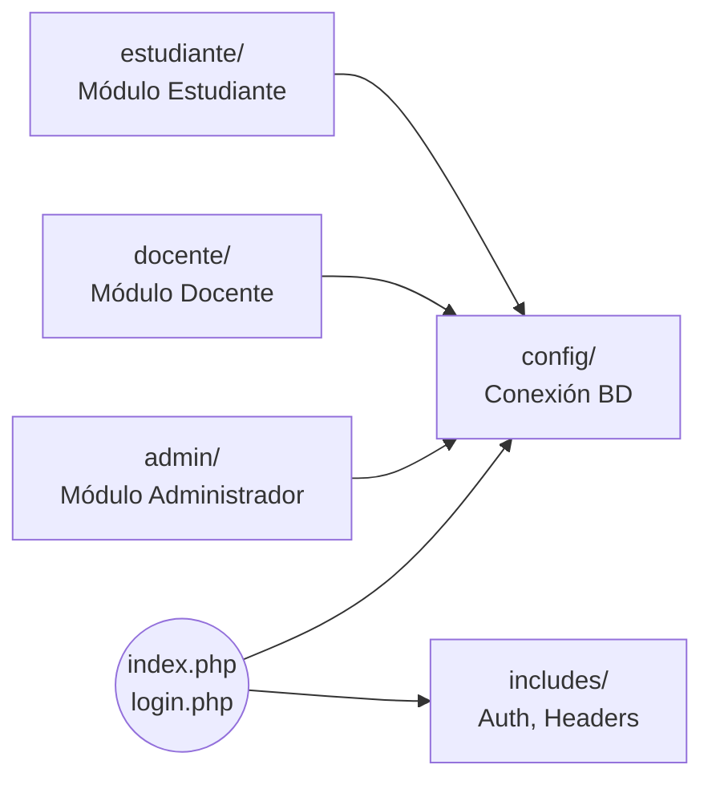

# Documentación de Arquitectura

## Visión General
La plataforma es una aplicación web clásica, renderizada del lado del servidor (Server-Side Rendering) desarrollada con PHP estructurado, MySQL y HTML/CSS.

## Stack Tecnológico
- **Frontend:** HTML5, CSS3, JavaScript (Vanilla).
- **Backend:** PHP 7.4+ (Enfoque procedimental con separación por carpetas).
- **Base de Datos:** MySQL 5.7+ / MariaDB.
- **Servidor Web:** Apache (XAMPP).

## Diagrama de Arquitectura (Modelo Cliente-Servidor)

```mermaid
graph TD
    Client["Navegador Web (Cliente)\nHTML/CSS/JS"]
    Web_Server["Servidor Web (Apache)"]
    App_Logic["Lógica PHP\n(Sesiones, Auth, Ruteo)"]
    DB_Server["Base de Datos\n(MySQL/MariaDB)"]
    Filesystem["Sistema de Archivos\n(Uploads)"]

    Client <-->|Peticiones HTTP/HTTPS| Web_Server
    Web_Server --> App_Logic
    App_Logic <-->|Consultas SQL (PDO)| DB_Server
    App_Logic <-->|Lectura/Escritura| Filesystem
```

## Estructura de Componentes



## Patrones de Diseño
El proyecto sigue un patrón de **Directorio por Rol**. No implementa un framework MVC estricto, sino que se divide en subdirectorios lógicos (`/admin`, `/docente`, `/estudiante`) donde cada módulo maneja su propia lógica de presentación y control, apoyándose en un conjunto centralizado de utilidades (`/config`, `/includes`).

- **Capa de Configuración:** `config/database.php` abstrae la conexión usando la interfaz segura PDO.
- **Capa de Control de Sesión:** `includes/auth.php` gestiona el estado del usuario (sesión iniciada) e inyecta la redirección si no hay acceso.
